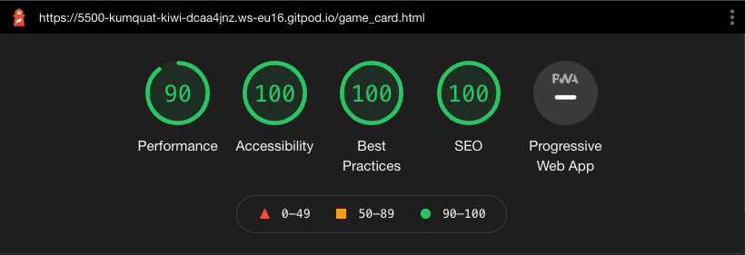
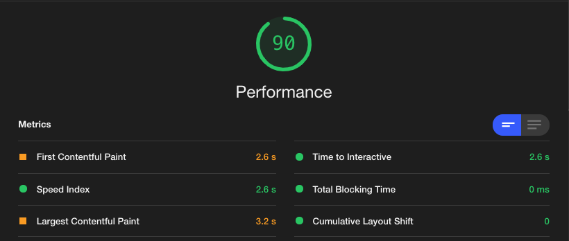
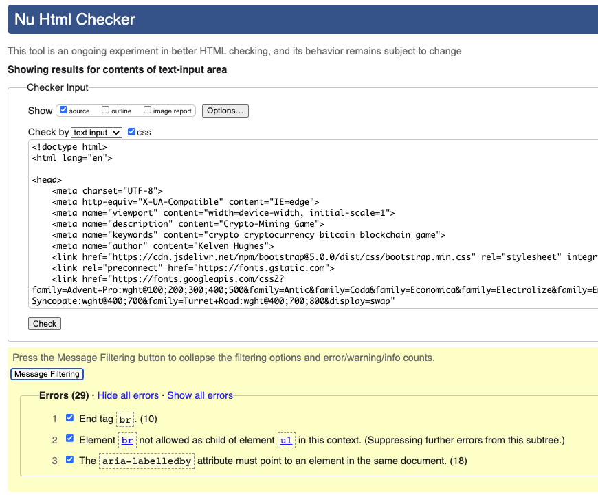
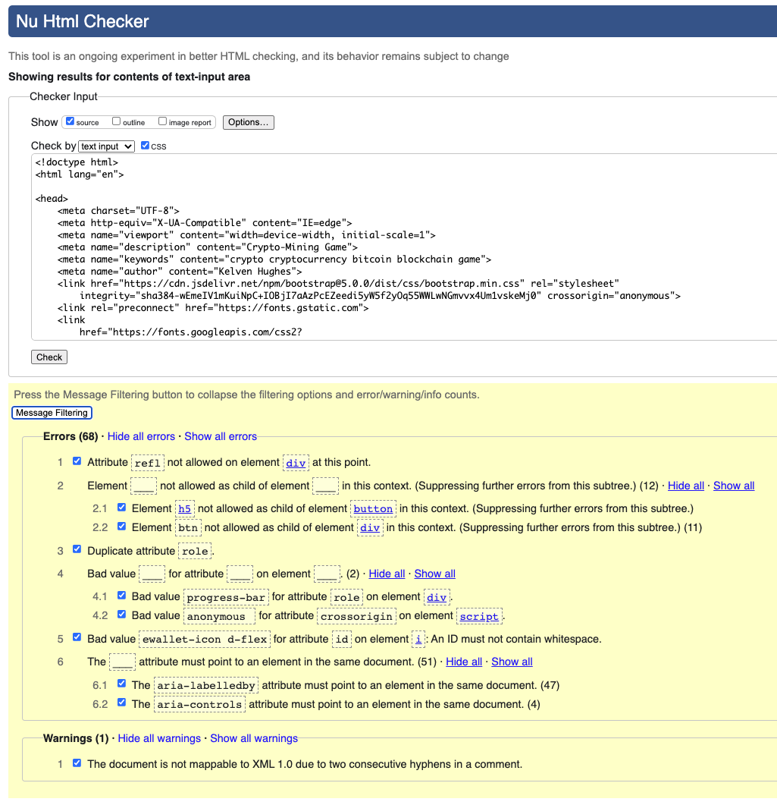
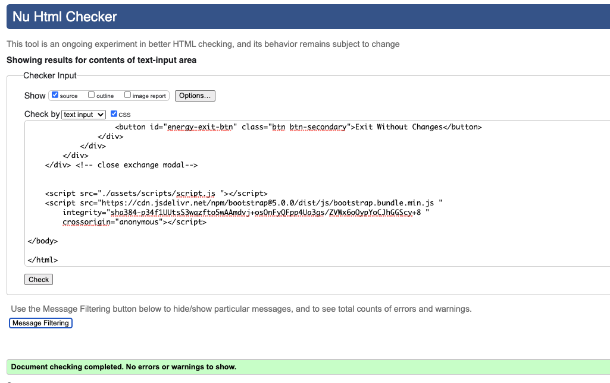
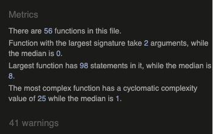
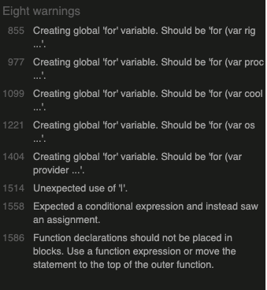

# Testing 

## Contents
- [Summary of Main Bugs and Status](#summary-of-main-bugs-and-status)
- [Testing Against User Stories](#testing-against-user-stories-and-project-brief)
- [Lighthouse Testing](#lighthouse-testing)
- [Code Validation](#code-validation)
  * [HTML](#html)
  * [CSS](#css)
  * [JavaScript](#javascript)
- [Browser Compatability](#browser-compatability)
- [Responsiveness](#responsiveness)

------

## Summary of Main Bugs and Status

The table below outlines key bugs / defects for which further information can be found from the related testing section. The table focuses on matters which remain outstanding and their affect.   

Issue | Details | Refer to Testing Section | Status | Comments |
|-----|----------|----------|-----|----------|

------

## Testing Against User Stories and Project Brief

 | User | User Requirement | Testing Result | Notes |
 | ---- | ---------------- | -------------- | -------- |

------

## Lighthouse Testing

Overall scores were high with only Performance reported below 100%. 

### Performance - 90

Breakdown of performance indicated time savings of;
- c. 1.4s 'Eliminate render blocking resources' 
- c. 0.75s 'Reduce unused JavaScript' 
- c. 03s - reduce unused CSS
The majority pointed to 3rd party dependencies (Bootstrap, Bootstrap icons, Font Awesome and JQuery) where no identified means to improve. There was also contribution from the css stylesheet, but no indications as to what in particular was a cause / could be enhanced to improve performance. No changes applied.

### Accessibility - 100
No actions to review

### Best Practices - 100
No actions to review

### SEO - 100
No actions to review

------

## Code Validation

### HTML 

Reviewed with W3C Markup Validation Service. Initial check identified 97 errors (split 27 index.html and 68 game_card.html. All errors were reviewed and addressed with subsequent check reporting 0 errors.

Initial Reports

Errors can be categorised as follows;
- 65 x 'aria-labelledby attribute must point to an element in the same document' : misunderstanding that this field represented a free format text field for screen readers. Cases related to modals including those with a nav tabs and content structure. Attribute changed to "aria-label' to ensure clear description remained. (Fixed)
- 4 x 'aria-controls attribute must point to an element in the same document' : values updated to align with the name of the nav content they relate to. (Fixed)
- 1 x 'bad value for attribute id' : related to error with a class name applied to the id field. (Fixed)
- 1 x 'attribute refl not allowed on div at this point' - attribute removed (Fixed)
- 1 reported (3 found) x 'h5 not allowed as child element of button' : h5 tag was used to apply button font size, but tag removed and font-sized appropriately (Fixed)
- 1 x 'duplicate role attribute : duplicate removed (Fixed)
- 1 x 'bad value progress-bar for attribute role : linked to issue above (Fixed)
- 11 x 'element btn not allowed as child element of div' : Mis-application of Bootstrap 'btn' class name used as tag. Tags changed to <button> (Fixed)
- 1 x 'bad value anonymous  for crossorigin attribute on script element': Erroneous trailing whitespace removed (Fixed)
- 10 x 'end tag br' : error with a closing tag being used fhen only the opening br tag required (Fixed) 
- 1 x 'element br not allowed as child to ul' : issue linked to above (Fixed)

Subsequent Reports

 
 
### CSS

 
 

### JavaScript

Reviewed with JSHint. Initially there were 41 warnings, following review this was reduced to 8.

Initial Report

Errors can be categorised as follows;
- 8 x '[' '] is better written in dot notation' : restructured array.object structure (Fixed)
- 11 x 'missing semi-colon' : semi-colon's applied (Fixed)
- 14 x 'unnecessary semicolon' : semi-colons removed (Fixed)
- 5 x 'Creating global 'for' variable. Should be 'for (var' - loop structure is from set of template literals. Format used is per examples viewed online including CodeInstitute material (no change)
- 1 x 'unexpected use of "|" '- used in a function to make a random selection from an array. Useage aligns with examples researched online and is working as expected (no change)
- 1 x 'expected a conditional expression and instead saw an assignment' :  the function leads to determining a variable result which is being passed to another function. Function is working as intended (no change)
- 1 x : 'Function declarations should not be placed in blocks' : function is declared outside of the function and subsequently determined through a series of nested functions. Attempted changes prevent the function from working as intended (no change)
 
Subsequent Report 

 
  
------  
  
## Browser Compatability
The CSS was run through https://autoprefixer.github.io/ to apply additional CSS tags.

Live testing was performed on https://www.lambdatest.com/ across key browsers, operating systems and resolution sizes. No major issues were noted.

------

## Responsiveness

