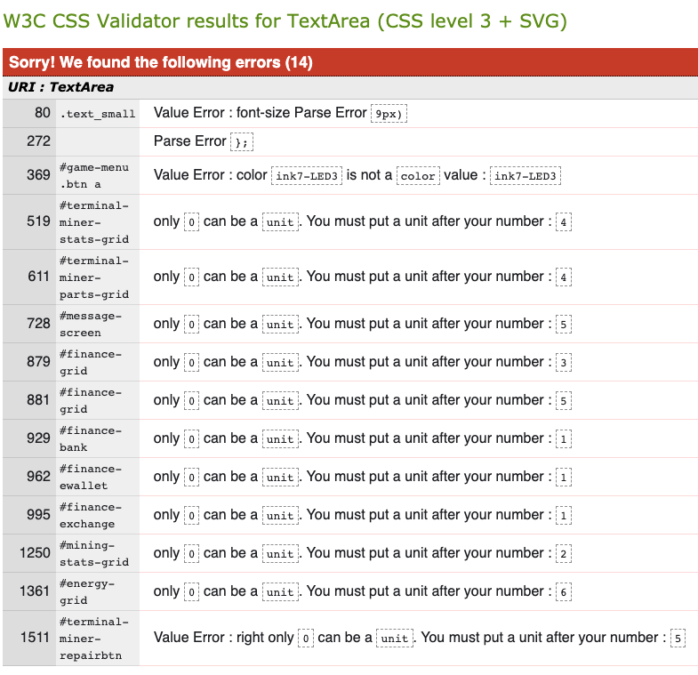
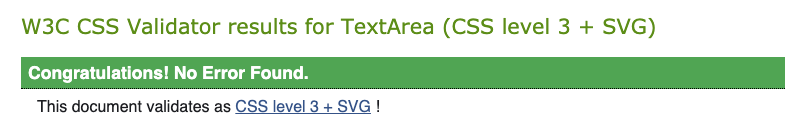

# Testing 

## Contents
- [Summary of Main Bugs and Status](#summary-of-main-bugs-and-status)
- [Testing Against User Stories](#testing-against-user-stories-and-project-brief)
- [Lighthouse Testing](#lighthouse-testing)
- [Code Validation](#code-validation)
  * [HTML](#html)
  * [CSS](#css)
  * [JavaScript](#javascript)
- [Browser Compatability](#browser-compatability)
- [Responsiveness](#responsiveness)

------

## Summary of Main Bugs and Status

The table below outlines key bugs / defects. Note that none of these were through final testing but experienced during the development.  

Issue | Details | Testing Section | Status | Comments |
|-----|---------|-----------------|--------|----------|
| Indicating if an item has already been purchaed | Unable to add an if statement within template literal. As a result all items in the upgrade shop have a Buy button, whereas wanted to indicate if item already purchased unless item was unavailable (i.e. broekn) | Identified in development | OPEN | Not a fundamental issue but could be considered as a future enhancement to gameplay |
| Unexpected behaviour | Some instances noticed of unexpected behaviour where gameplay flows through the mutipe functions / scenarios which are not easy to replicate. For exmaple, there can be occassions where the in game check (to identify if balance nil / game over) can occur in the midst of another stage of gameplay leading to a game over message and play continuing. Likley needs a more specific set of functional flow to avoid these being encountered, but instances were low and difficult to replicate in development.| Identified in development | OPEN | Low occurrence after adding additional modal.hide at specific points in JS script|
| Game Play Out of Synch |Instances were encountered where player selecting buttons whilst the game cycle was running lead to incorrect order of modals / gameplay e.g. upgrading terminal whilst running | Identified in development | CLOSED | Buttons deactivated when event / gamecycle in operation and reactivated afterwards |
| Blockkey error | Calculation to create random miner key (number) led to instances where key number was outside of the expected range leading to neither a successful / unsuccesful attempt | Identified in development | CLOSED | A min floor value added to calculation which prevented scenario |
| The same miner key can be selected | After determining a random key number, this is removed from the range array, however the next key can still select this same number despite console.logs showing the number has been removed from the array | Identified in development | OPEN | Not clear why this is being encountered and no further time to investigate |
| Bootstrap progress animation | The automatic 'reverse' animation to reset the progress bar eats into the time of the next cycle commencing which could make it appear as if progress was resetting from 40% | Identified in development | CLOSED | Adjustments made to the timer in terms of how often the bar is refreshed. Also applied a class to remove and re-apply the animation at start / end of cycle |

------

## Testing Against User Stories and Project Brief

 | User Requirement | Testing Result | Notes |
 | ---------------- | -------------- | -------- |
 | Navigate the site easily | PASS | Clear panel and button labelling, links work | 
 | Understand how to play | PASS | Embedded video with walkthrough of the panels and interactions |
 | Be able to manage any inputs / actions easily | PASS | All interactions are through point and click with no keyboard inputs required |
 | See what ‘performance score / stats’ they have | PASS | Added simple stats table which is displayed when game cycle not in operation |
 | Make interactive decisions to determine game outcome | PASS | Intergrated decisions into events. All gameplay mechanics linked to player decisions |

------

## Lighthouse Testing

Overall scores were high with only Performance reported below 100%. 

### Performance - 90

Breakdown of performance indicated time savings of;
- c. 1.4s 'Eliminate render blocking resources' 
- c. 0.75s 'Reduce unused JavaScript' 
- c. 03s - reduce unused CSS
The majority pointed to 3rd party dependencies (Bootstrap, Bootstrap icons, Font Awesome and JQuery) where no identified means to improve. There was also contribution from the css stylesheet, but no indications as to what in particular was a cause / could be enhanced to improve performance. No changes applied.

### Accessibility - 100
No actions to review

### Best Practices - 100
No actions to review

### SEO - 100
No actions to review

------

## Code Validation

### HTML 

Reviewed with W3C Markup Validation Service. Initial check identified 97 errors (split 27 index.html and 68 game_card.html. All errors were reviewed and addressed with subsequent check reporting 0 errors.

Initial Reports

Errors can be categorised as follows;
- 65 x 'aria-labelledby attribute must point to an element in the same document' : misunderstanding that this field represented a free format text field for screen readers. Cases related to modals including those with a nav tabs and content structure. Attribute changed to "aria-label' to ensure clear description remained. (Fixed)
- 4 x 'aria-controls attribute must point to an element in the same document' : values updated to align with the name of the nav content they relate to. (Fixed)
- 1 x 'bad value for attribute id' : related to error with a class name applied to the id field. (Fixed)
- 1 x 'attribute refl not allowed on div at this point' - attribute removed (Fixed)
- 1 reported (3 found) x 'h5 not allowed as child element of button' : h5 tag was used to apply button font size, but tag removed and font-sized appropriately (Fixed)
- 1 x 'duplicate role attribute : duplicate removed (Fixed)
- 1 x 'bad value progress-bar for attribute role : linked to issue above (Fixed)
- 11 x 'element btn not allowed as child element of div' : Mis-application of Bootstrap 'btn' class name used as tag. Tags changed to <button> (Fixed)
- 1 x 'bad value anonymous  for crossorigin attribute on script element': Erroneous trailing whitespace removed (Fixed)
- 10 x 'end tag br' : error with a closing tag being used fhen only the opening br tag required (Fixed) 
- 1 x 'element br not allowed as child to ul' : issue linked to above (Fixed)

Subsequent Reports

 
 
### CSS
Reviewed with W3C CSS Validation Service. Review identified 14 errors, all reviewed and addressed.
Initial Report

 Errors can be grouped as;
- 10 x 'only 0 can be a unit' : these related to unnessecary use of the grid-rows atribute which was being used to declare the number of grid rows now removed (Fixed)
- 1 x 'value error only 0 can be a unit' : value was missing vw unit, now applied (Fixed)
- 1 x 'value error font-size Parse Error : was within a clamp but no longer used and removed (Fixed)
- 1 x 'parse error };' - an erroneous ';' was added to css statement (Fixed)
- 1 x 'value error not a color' : color declaration was missing the var(--' prefix (Fixed)
 
Subsequent Report

 

### JavaScript

Reviewed with JSHint. Initially there were 41 warnings, following review this was reduced to 8.

Initial Report

Errors can be categorised as follows;
- 8 x '[' '] is better written in dot notation' : restructured array.object structure (Fixed)
- 11 x 'missing semi-colon' : semi-colon's applied (Fixed)
- 14 x 'unnecessary semicolon' : semi-colons removed (Fixed)
- 5 x 'Creating global 'for' variable. Should be 'for (var' - loop structure is from set of template literals. Format used is per examples viewed online including CodeInstitute material (no change)
- 1 x 'unexpected use of "|" '- used in a function to make a random selection from an array. Useage aligns with examples researched online and is working as expected (no change)
- 1 x 'expected a conditional expression and instead saw an assignment' :  the function leads to determining a variable result which is being passed to another function. Function is working as intended (no change)
- 1 x : 'Function declarations should not be placed in blocks' : function is declared outside of the function and subsequently determined through a series of nested functions. Attempted changes prevent the function from working as intended (no change)
 
Subsequent Report 

 
  
------  
  
## Browser Compatability
The CSS was run through https://autoprefixer.github.io/ to apply additional CSS tags.

Live testing was performed on https://www.lambdatest.com/ across key browsers, operating systems and resolution sizes. No major issues were noted.

------

## Responsiveness

 This game suits a larger screen size due to the 'dashboard' style gameplay. Howver, to accomodate responsive sizing; 

 - the site has been built using the bootstrap framework using grid layout. Differen column sizing for screens was not employed as this would break the panel layout. However; 
- unit measurements (e.g. height / width / padding / margins) are typically set in VH / VW units (with the exception of measurements coming from Bootstrap, override of Bootstrap)
- specific challanges encountered with small screens for which media queries are used for example, adjust padding / margins and location of buttons so not hidden. 
- small number of JS media functions used where targetted changes needed such as changing the HTML text content to avoid word wraps, removing some non-key fields (e.g. within the 'event messaging' panel). 

It should be noted that whilst the page is responsive, it is acknowledged that aspects are smaller than ideal for small screens. Whilst this does not prohibt use of the site / features, further enhancmenets could be applied to improve the visual layout (noted as a potential future enhancement).

Local testing was performed on;

- mobile (iOS)
- tablet (ios)
- medium screen (Safari & Chrome)
- wide-screen (Safari & Chrome

Live testing performed on https://www.lambdatest.com/ for a selection of other screen resolution sizes / browsers.

